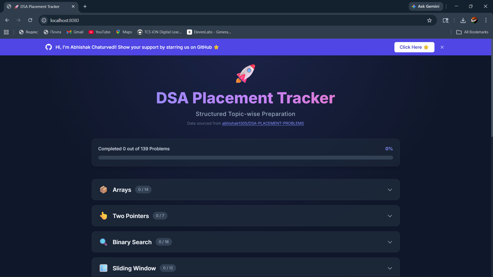

# DSA Placement Tracker

A structured, topic-wise **Data Structures and Algorithms (DSA)** problem tracker built for placement preparation. This static web application provides a curated list of **100+ handpicked problems** spanning 13 core DSA topics, complete with progress tracking, difficulty indicators, and direct practice links to LeetCode and GeeksforGeeks.

---

## Overview

Preparing for technical placements requires a disciplined, structured approach to DSA problem solving. The **DSA Placement Tracker** organizes problems by topic and difficulty, allowing users to systematically work through each category and track their progress in real time.

The application runs entirely in the browser with no backend dependencies. All progress is persisted locally using `localStorage`, ensuring that users never lose their tracked state across sessions.

---

## Features

- **13 DSA Topics** — Arrays, Two Pointers, Binary Search, Sliding Window, Maps & Strings, 2D Matrix, Recursion, Linked Lists, Doubly Linked Lists, Stacks, Queues, Trees, and Binary Search Trees.
- **100+ Curated Problems** — Sourced from LeetCode and GeeksforGeeks, categorized by Easy, Medium, and Hard difficulty.
- **Real-Time Progress Tracking** — A global progress bar and per-topic counters update dynamically as problems are marked complete.
- **Persistent State** — Progress is saved to the browser's `localStorage` and restored automatically on revisit.
- **Collapsible Topic Sections** — Clean, accordion-style navigation with smooth expand/collapse animations.
- **Direct Practice Links** — One-click access to solve each problem on its respective platform.
- **Difficulty Badges** — Color-coded labels (green for Easy, orange for Medium, red for Hard) for quick visual scanning.
- **Responsive Design** — Fully responsive layout optimized for desktop, tablet, and mobile screens.
- **Dark Theme UI** — A modern, dark-themed interface using the Inter font and subtle gradient effects.

---

## Tech Stack

| Layer         | Technology                  |
|---------------|-----------------------------|
| Structure     | HTML5                       |
| Styling       | Tailwind CSS (via CDN)      |
| Logic         | Vanilla JavaScript (ES5+)   |
| Typography    | Google Fonts (Inter)        |
| Containerization | Docker + Nginx           |
| Orchestration | Docker Compose              |

---

## Project Structure

```
DSA SHEET WEB APPLICATION/
├── index.html            # Main application entry point
├── script.js             # DSA problem data and application logic
├── Dockerfile            # Docker image configuration (Nginx-based)
├── docker-compose.yml    # Docker Compose service definition
├── screenshot/           # Application and Docker screenshots
│   ├── docker build.png
│   ├── docker run.png
│   ├── docker ps.png
│   └── localhost.png
└── README.md             # Project documentation
```

---

## Getting Started

### Prerequisites

- A modern web browser (Chrome, Firefox, Edge, or Safari)
- (Optional) [Docker](https://www.docker.com/products/docker-desktop/) for containerized deployment

### Local Setup

1. **Clone the repository**

   ```bash
   git clone https://github.com/abhishak1305/DSA-PLACEMENT-PROBLEMS.git
   ```

2. **Navigate to the project directory**

   ```bash
   cd DSA-PLACEMENT-PROBLEMS/DSA\ SHEET\ WEB\ APPLICATION
   ```

3. **Open the application**

   Open `index.html` directly in your browser, or use a local development server:

   ```bash
   # Using Python
   python -m http.server 8080

   # Using Node.js (http-server)
   npx http-server -p 8080
   ```

4. **Access the application**

   Open [http://localhost:8080](http://localhost:8080) in your browser.

---

## Docker Setup

### What is Docker?

Docker is a platform that packages applications into lightweight, portable units called **containers**. A container bundles the application code along with all its dependencies and runtime environment, ensuring that the application runs consistently across any machine — whether it is a developer's laptop, a staging server, or a production environment.

**Why use Docker for this project?**

- **Consistency** — The application behaves identically regardless of the host operating system.
- **No local dependencies** — No need to install or configure a web server manually.
- **Easy deployment** — A single command builds and runs the entire application.
- **Portability** — The Docker image can be shared, deployed to cloud services, or run on any Docker-enabled machine.

### Understanding the Dockerfile

The `Dockerfile` in this project defines how the application image is built:

```dockerfile
FROM nginx:alpine

# Remove default nginx files
RUN rm -rf /usr/share/nginx/html/*

# Copy your portfolio files into nginx folder
COPY . /usr/share/nginx/html

EXPOSE 80
```

| Instruction                              | Purpose                                                                 |
|------------------------------------------|-------------------------------------------------------------------------|
| `FROM nginx:alpine`                      | Uses a lightweight Nginx web server image based on Alpine Linux.        |
| `RUN rm -rf /usr/share/nginx/html/*`     | Clears the default Nginx welcome page and placeholder files.            |
| `COPY . /usr/share/nginx/html`           | Copies all project files into the Nginx web root directory.             |
| `EXPOSE 80`                              | Documents that the container listens on port 80 for HTTP traffic.       |

### Build and Run with Docker

**Step 1 — Build the Docker image**

```bash
docker build -t portfolio-docker .
```

This command reads the `Dockerfile`, downloads the Nginx base image, copies the application files, and creates a new Docker image tagged as `portfolio-docker`.

**Step 2 — Run the container**

```bash
docker run -d -p 8080:80 portfolio-docker
```

| Flag            | Description                                                              |
|-----------------|--------------------------------------------------------------------------|
| `-d`            | Runs the container in detached (background) mode.                        |
| `-p 8080:80`    | Maps port **8080** on your machine to port **80** inside the container.  |
| `portfolio-docker` | The name of the Docker image to run.                                  |

> **Port Mapping Explained:** The format `-p HOST:CONTAINER` means that requests sent to `localhost:8080` on your machine are forwarded to port `80` inside the container, where Nginx is serving the application.

**Step 3 — Verify the container is running**

```bash
docker ps
```

This lists all running containers. You should see an entry for `portfolio-docker` with port `0.0.0.0:8080->80/tcp`.

**Step 4 — Access the application**

Open [http://localhost:8080](http://localhost:8080) in your browser.

**Step 5 — Stop and remove the container (when done)**

```bash
docker stop <container_id>
docker rm <container_id>
```

### Using Docker Compose

Docker Compose simplifies multi-container or configured deployments by defining services in a YAML file. For this project, `docker-compose.yml` is configured as follows:

```yaml
version: '3.8'

services:
  portfolio:
    build: .
    container_name: portfolio-container
    ports:
      - "8080:80"
```

**Start the application**

```bash
docker-compose up --build
```

This command builds the image (if not already built or if files have changed) and starts the container in one step. Add the `-d` flag to run in detached mode:

```bash
docker-compose up --build -d
```

**Stop the application**

```bash
docker-compose down
```

This stops and removes the container, cleaning up all associated resources.

---

## Screenshots

The following screenshots demonstrate the application running successfully inside a Docker container.

### Docker Build

<!-- Replace with your screenshot path or URL -->


### Docker Run

<!-- Replace with your screenshot path or URL -->


### Docker PS (Container Status)

<!-- Replace with your screenshot path or URL -->


### Application Running on Localhost

<!-- Replace with your screenshot path or URL -->


---

## Future Improvements

- [ ] Add topic-wise filtering and search functionality
- [ ] Implement export/import of progress data (JSON backup)
- [ ] Add solution hints and approach notes for each problem
- [ ] Integrate a timer for timed practice sessions
- [ ] Add support for custom problem lists and user-defined topics
- [ ] Deploy to a cloud platform (Vercel, Netlify, or AWS)
- [ ] Implement a leaderboard or community progress sharing feature
- [ ] Add dark/light theme toggle

---

## Author

**Abhishak Chaturvedi**

- GitHub: [github.com/abhishak1305](https://github.com/abhishak1305)
- Email: [abhishak1305@gmail.com](mailto:abhishak1305@gmail.com)

---

## License

This project is open source and available for personal and educational use.

---

> If you find this project helpful, consider giving it a star on [GitHub](https://github.com/abhishak1305/DSA-PLACEMENT-PROBLEMS). Contributions and feedback are always welcome.
